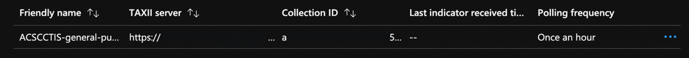

 

# Bi-directional sharing of threat indicators with Microsoft Sentinel and the ACSC Cyber Threat Intelligence Sharing platform

# Introduction

The purpose of this document is to define detailed procedures for the configuration of Microsoft Sentinel to onboard to the Australian Cyber Security Centre (ACSC) Cyber Threat Intelligence Sharing (CTIS) platform using Microsoft Sentinel.

# Background

The CTIS service is only available to organisations who have signed up as a deeded ACSC Network Partner. To initiate the process to onboard to the CTIS service, please register your interest via the ACSC Partner Portal on the CTIS page. Once the initial onboarding process is completed, the CTIS Service Desk will be in contact to arrange a technical onboarding session where the following steps will be completed. Optionally, ACSC Partners can choose to contribute indicators from Sentinel to the CTIS Community. A separate set of credentials will be provisioned to contribute upon confirmation of readiness to contribute to the service.

>**Note:**
>
>The following general rules apply to content being submitted to CTIS:
>1. All contributions must meet minimum requirements for the CTIS data model, sent to Partners during onboarding. At minimum CTIS requires the following attributes:
>  a. Traffic Light Protocol (TLP) indicating the shareability of the indicators. Note the playbook will set a default TLP tag as a STIX marking definition, which can be fine-tuned using Labels per indicator.
>  b. Confidence level indicating the confidence in the accuracy of the intelligence, and can be selected during submission by the end user.
>2. Please only share validated indicators that appear to be associated with malicious activity, an investigation could have many types of indicators that are not relevant to CTIS.
>3. Context is key, please use description and label fields to provide additional information surrounding the incident.
>4. All content submitted to CTIS is validated by a CTIS Threat Intelligence team analyst for accuracy and correlation. Please consider whether indicators may be relevant to the wider CTIS community before submission.
>

# Steps to complete on Microsoft Azure to Consume from CTIS

1. From the Azure portal, navigate to the Microsoft Sentinel service.

 

2. Choose the workspace to which you want to import threat indicators from the TAXII server.

 

3. Select **Content Hub** from the left toolbar, select **Threat Intelligence** from the connectors gallery, and click **Install**.

 

 Once installed, select **Data Connectors** from the left toolbar, select **Threat Intelligence – TAXII**, then click **Open connector page**.

 

4. Enter a friendly name for this TAXII server Collection, the API Root URL, the Collection ID, a Username, and a Password, and choose the group of indicators and the polling frequency you want. Select the Add button.

 

| Parameter | Value |
| :--- | :--- |
| **Friendly Name** | Feed Name |
| **API root URL** | https://taxii2.ctis-au.org/trustgroup1/ |
| **Collection ID** | Feed UUID |
| **Username** | Partner Username |
| **Password** | Partner Password |
| **Import Indicators** | At most one month old |
| **Polling Frequency** | Once an hour |

5. You should receive confirmation that a connection to the TAXII server was established successfully, and you may repeat the last step above as many times as you want, to connect to multiple Collections from one or more TAXII servers.

 

 

# Configuring Sentinel Playbook to Contribute to CTIS

This playbook is used to configure Sentinel with the functionality to send created indicators back to CTIS. This playbook is a LogicApp script to bundle Indicators from Sentinel into a STIX package for submission to CTIS.

*Note: you will need to ensure you are logged in with an account that has full access to the Azure subscription before attempting this steps.*

1. From the Azure portal, navigate to the Microsoft Sentinel service.

 

2. Choose the workspace.

 

3. Select Content Hub, search for **Australian Cyber Security Centre**, and click **Install**. The current version is **3.0.2**.

 

4. After installation is complete, click **Manage**, and on the following page, select the Logic App called _AusCtisExportTaggedIndicators_ and click **Configuration**.

 

 

5. Select the Logic App called _AusCtisExportTaggedIndicators_ and click **Create Playbook**.

 

6. Leave all the displayed fields as default, and click **Next: Parameters \>**

 

7. Enter the required parameters. Click **Next: Review and create \>**

| Parameter | Value |
| :--- | :--- |
| **TAXIIServerRootURL** | https://taxii2.ctis-au.org/trustgroup1 |
| **TAXIIServerUsername** | Partner Username provided by CTIS |
| **TAXIIServerPassword** | Partner Password provided by CTIS |
| **CollectionID** | Created Partner collection UUID provided by CTIS |
| **SentinelWorkspace** | Name of your Sentinel Instance |
| **Default TLP Label** | This will provide a TLP Label to all future submissions by default. You can still define a TLP per indicator through tags |

 

8. Confirm parameters and press **Create and continue to designer.**

 

9. Navigate to the Log Analytics Workpace that the Sentinel is deployed to, and navigate to **Access Control (IAM)**. Select **Add role assignment**.

 

 
 
 10. Search for Contributor and select **Contributor**. Click **Next.**

 

11. Select **Managed Identity**, then click **Select members**. On the right side menu under Managed Identity, select **Logic App** then select **AusCtisExportTaggedIndicators**. Click **Select**, then on the main page click **Review + assign.**

 

12. In Sentinel, to create a test event, go to **Threat Intelligence**, then click **Add new**.

 

13. Add the required fields and click **Apply**. Please include a Traffic Light Protocol (TLP) colour rating for the intelligence, adhering to the TLP Protocol for sharing:
[**https://www.cisa.gov/news-events/news/traffic-light-protocol-tlp-definitions-and-usage**](https://www.cisa.gov/news-events/news/traffic-light-protocol-tlp-definitions-and-usage)
- Specificy the TLP as a Tag, in the format "TLP:\<Colour\>", for instance:
  - TLP:Green
  - TLP:Amber
  - TLP:Clear

>**Note – CTIS will not process TLP:Red indicators**

 

14. Go to the created Logic App and click **Run Trigger**. This will push the event to CTIS.

 

 The Logic App runs once per day by default.

**Recommendation:** CTIS packages contributions by Partners into a single STIX package. It is recommended that the playbook only be run once all Indicators have been tagged for Export by adding the AusCtisExport tag. This ensures CTIS threat analysts have contextual information to link indicators into a single campaign. If there is uncertainty, a CTIS Threat Intel Analyst will contact the submitting organisation for clarity.

# Guidance for creating a new indicator to share with CTIS

Indicators can be created manually in Microsoft Sentinel under **Threat management \> Threat intelligence** or you can select the **Add to TI** option for an entity from the incident investigation pages.

 

 

# Microsoft Sentinel Threat Intelligence Indicators for use with CTIS

Supported types for creation through the UI: **file** , **domain-name** , **url** , **ipv4-addr** , **ipv6-addr**. Indicators with type **Multiple** or **email-addr** can be viewed but not created.
 Common elements: **Description, Name** , **Tags** , **Threat types** , **Revoked** , **Confidence** , **Kill chains** (Lockheed Martin), **Valid from** , **Valid until**. All optional except **Valid from**.

Current use of tags (free text entry):

- **TLP:** _**[value]**_, checked by the playbook for specific values otherwise a default is used.
- **Incident ID:** _**[id]**_, added by Sentinel when creating an indicator from an incident, playbook currently adds this to the description.
- **ACSC Export/ACSC Export Complete** , identifies indicators to be processed by the playbook and when submission is complete.

>**NOTE: All indicators that are related to the same Incident in Sentinel should be submitted in a single run of the playbook. If multiple incidents are being submitted, please run the playbook once after tagging the indicators separately mapping to the Incident ID.**

     

